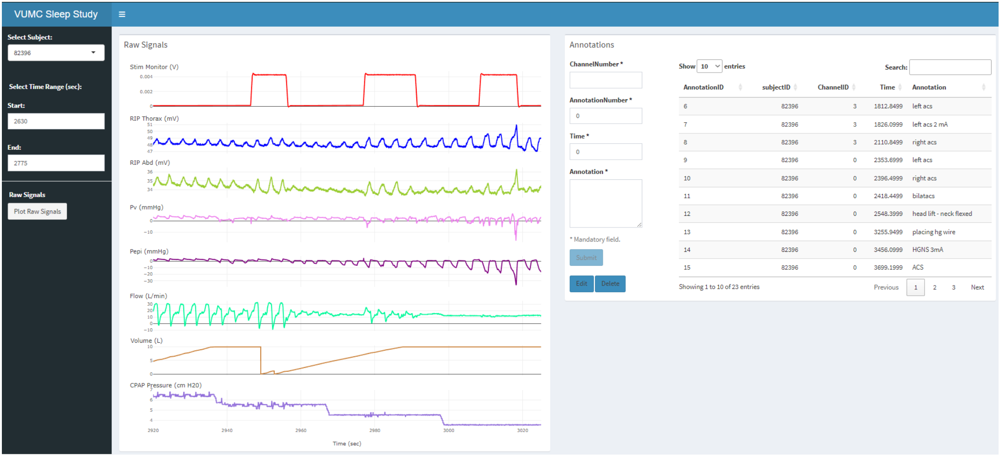
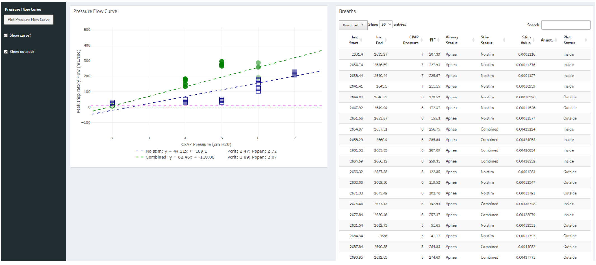

**Polysomnography Interface.** R Shiny app designed to visualize drug-induced sleep endoscopy (DISE) data. Graphs on the left show data for eight variables measured during DISE. Annotation system shown on the right.

**Pressure-flow Interface.**  R Shiny app designed to visualize drug-induced sleep endoscopy (DISE) data. Graph on the left shows airflow vs. CPAP pressure for breaths in selected time window. Breath-level measures table shown on the right.

